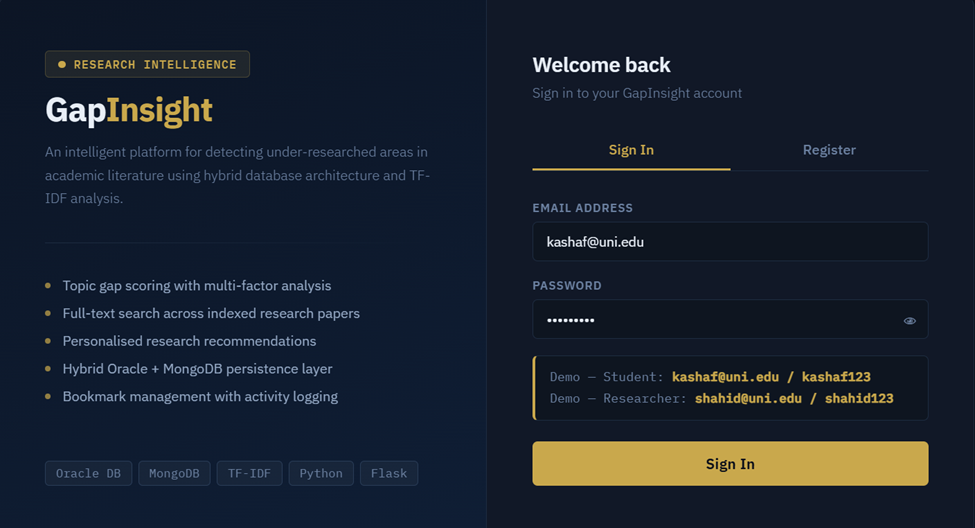
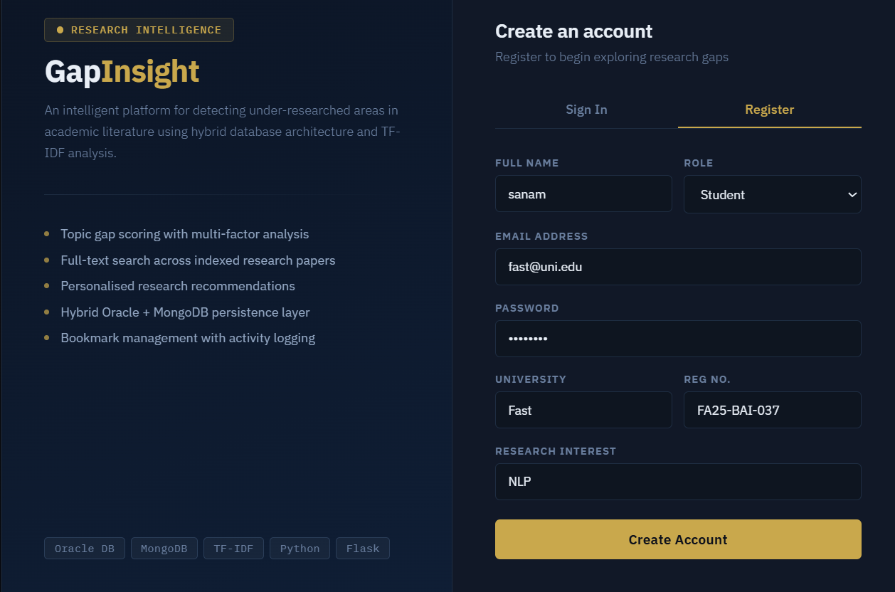
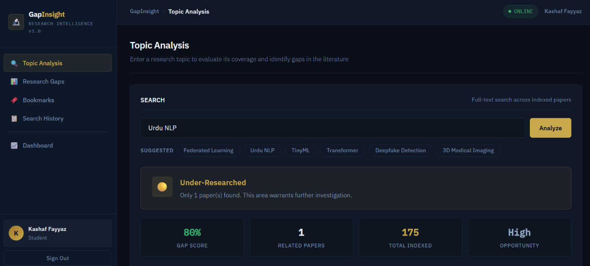
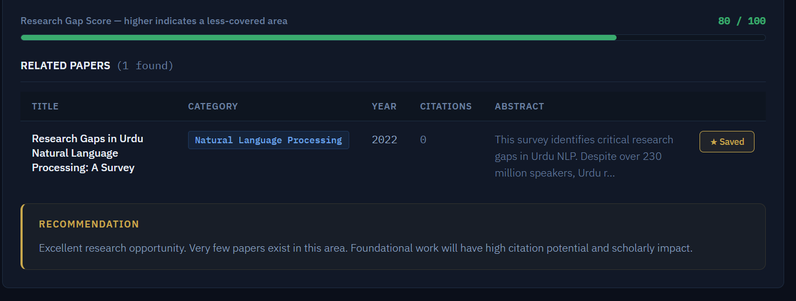
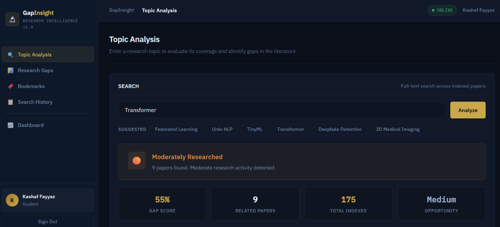
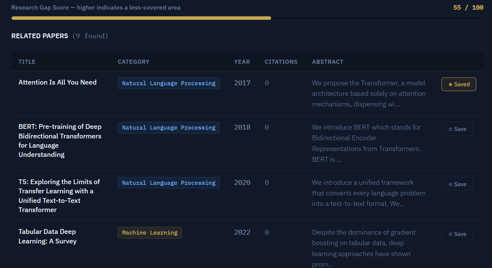
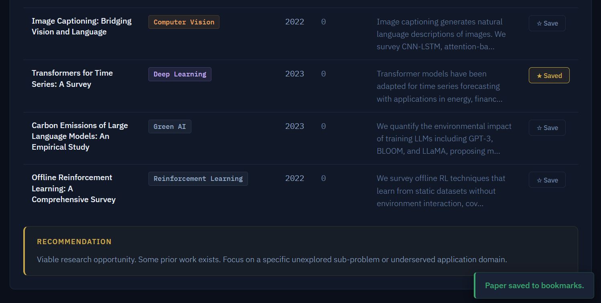
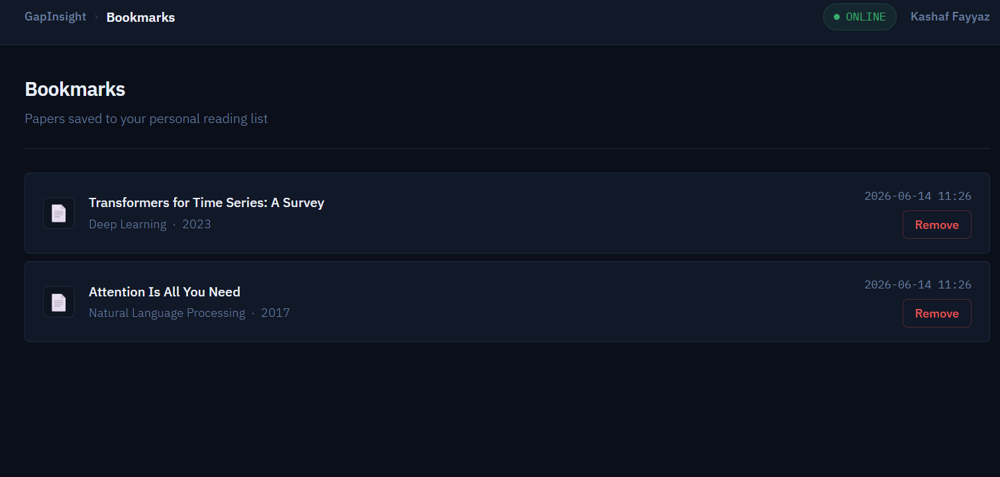
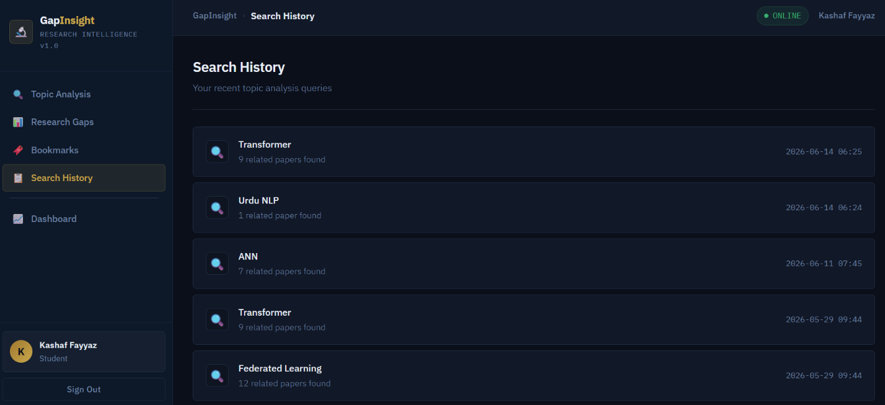
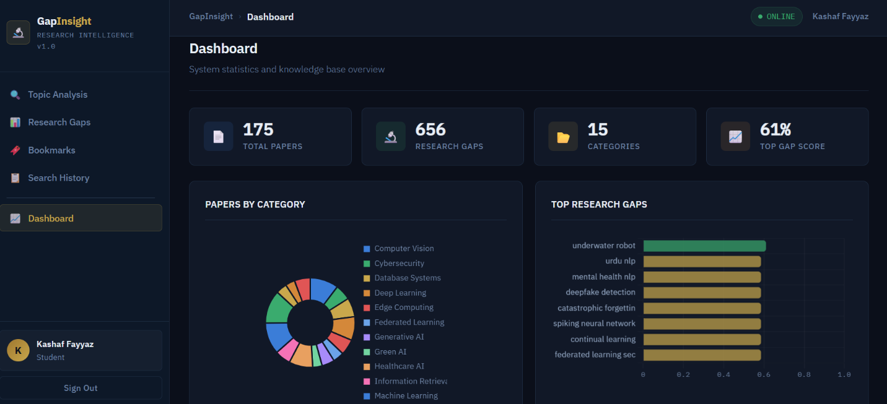

# 🔬 GapInsight — Research Gap Detection System

> What if you could know — before writing a single line of research — whether your topic has already been explored extensively?

GapInsight helps researchers quickly evaluate the novelty of a research topic. Enter a topic, and the system classifies it as:

- 🔴 **Severely Under-Researched** — high potential for new contributions
- 🟡 **Moderately Researched** — opportunities still exist
- 🟢 **Saturated** — already extensively explored

Builta project for **Database Systems**, combining a relational and a document database to play to each one's strengths, backed by a real multi-factor gap-scoring algorithm (not just a paper count).

---

## 📸 Screenshots





















---

## ⚙️ Architecture

GapInsight uses a **hybrid SQL + NoSQL architecture**, choosing each database for what it's actually good at:

| Layer | Technology | Responsibility |
|---|---|---|
| Backend / API | **Flask + Flask-CORS** | REST API, session auth, gap-detection pipeline, bridges both databases |
| Relational data | **Oracle SQL** (via `oracledb`, thin mode) | Users, roles, profiles, bookmarks, recommendations, detected research gaps |
| Document data | **MongoDB** (via `pymongo`) | Papers, abstracts, keyword frequency table, search history, notes, research clusters |

**Why hybrid?** User accounts, roles, and relationships benefit from SQL's referential integrity and constraint enforcement — especially since this project also doubles as an EER-modeling exercise (see below). Paper metadata (variable-length keyword arrays, full-text search, high write volume) fits a document store better. Flask sits in between, coordinating both and using MongoDB `ObjectId`s as foreign-key-style references inside Oracle (`Bookmarks.paper_id`, `Paper_Author.paper_id`).

---

## 🧬 Database Design Highlights (EER Modeling)

The Oracle schema isn't just flat tables — it deliberately demonstrates several Enhanced ER modeling patterns end-to-end, translated into real constraints:

- **Disjoint specialization** — `Users` is a superclass; `Student`, `Researcher`, and `Admin_User` are mutually exclusive subclasses, enforced via a `CHECK` constraint on `role`.
- **Overlapping specialization** — `Author` and `Reviewer` are independent subclasses a `User` can belong to simultaneously (unlike Student/Researcher/Admin).
- **Multiple inheritance** — `Research_Assistant` inherits from *both* `Student` and `Researcher` at once, with foreign keys into both parent tables.
- **Union type (Category)** — `Contributor` can be backed by *either* an internal `User` or an `External_Expert`, enforced with a `CHECK` constraint requiring exactly one side to be populated.
- **Total participation** — every `Bookmark` requires a `user_id` (`NOT NULL`), enforcing that bookmarks can't exist without an owning user.
- **Cross-database referential integrity** — `Paper_Author.paper_id` and `Bookmarks.paper_id` are Oracle `VARCHAR2` columns storing MongoDB `ObjectId`s as strings, bridging the two systems without a shared native key type.

Schema also includes **16 tables**, **13 indexes**, **10 triggers** (auto-incrementing PKs via sequences, plus an audit trigger that logs every new user registration automatically), **2 stored procedures** (`sp_register_user`, `sp_get_recommendations`), and **4 views** (`vw_user_full`, `vw_top_gaps`, `vw_user_activity`, `vw_author_papers`).

---

## 🧠 How Gap Scoring Works

Gap detection isn't a single "paper count" — it's a **weighted, multi-factor score** computed per keyword:

| Factor | Weight | Signal |
|---|---|---|
| **Frequency score** | 40% | Fewer papers on a topic → higher gap score (log-scaled, not linear) |
| **Citation-gap score** | 25% | High average citations + few papers = demand exceeds supply |
| **Recency score** | 20% | Newest paper on the topic is old → coverage is stale |
| **Demand bonus** | 15% | Known high-impact-but-under-studied areas (e.g. Urdu/Pashto NLP, TinyML, federated learning security) get a scoring bonus to surface them |

**Pipeline:**
1. Keywords are extracted from paper titles/abstracts/keyword fields using **TF-IDF** (`scikit-learn`) with unigrams + bigrams, after cleaning with **NLTK** (stopword removal + WordNet lemmatization).
2. Keyword frequency is tallied across the corpus (150 seeded papers spanning 15 research categories).
3. Each keyword gets a gap score from the weighted formula above, plus a human-readable explanation (e.g. *"Only 12 paper(s) cover this. High avg citations suggest demand exceeds supply."*).
4. Results are written to both databases: full scored list to MongoDB (`keywords` collection), top 30 to Oracle (`Research_Gaps` table) for relational querying/reporting.
5. On the query side, submitting a topic runs it against the corpus and buckets it into **Severely Under-Researched / Under-Researched / Moderately Researched / Well Researched / Saturated** based on how many matching papers exist.

A **Recommender** layer also generates personalized topic suggestions per user — blending each gap's score (70%) with relevance to the user's stated research interest and recent search history (30%).

---

## ✨ Key Features

- 📌 Hybrid SQL + NoSQL architecture with EER-modeled Oracle schema
- 📌 Multi-factor automated research-gap scoring (frequency, citations, recency, demand)
- 📌 TF-IDF + NLTK keyword extraction across a 150-paper, 15-category corpus
- 📌 Weighted MongoDB full-text search (title/abstract/keywords, ranked by relevance)
- 📌 Personalized recommendations based on user interest + search history
- 📌 User bookmark system and private/shareable research notes
- 📌 Role-based accounts (Student / Researcher / Admin) with SHA-256-hashed passwords and session auth
- 📌 Full audit trail via `Activity_Log`, auto-populated by database triggers

---

## 🛠️ Tech Stack

- **Backend:** Python, Flask, Flask-CORS
- **Relational DB:** Oracle SQL, accessed via `oracledb` (thin mode — no Instant Client required)
- **Document DB:** MongoDB, accessed via `pymongo`
- **NLP / Scoring:** scikit-learn (`TfidfVectorizer`, cosine similarity), NLTK (stopwords, tokenization, WordNet lemmatization), NumPy
- **Auth:** SHA-256 password hashing, Flask session-based authentication

---

## 📂 Project Structure

```
GapInsight/
├── oracle_schema.sql        # Oracle DDL: tables, sequences, triggers, procedures, views, sample data
├── mongodb_schema.py        # MongoDB collections, JSON-schema validators, indexes, seed data
├── add_papers.py            # Bulk-inserts 150 research papers across 15 categories
├── gapinsight_engine.py     # OracleDB/MongoDB wrappers, KeywordExtractor, GapDetector, Recommender, auth
├── gapinsight_app.py        # Flask app: routes, login/register UI, REST API
├── screenshots/             # App screenshots (referenced above)
└── requirements.txt
```

---

## 🚀 Setup & Installation

> **Note:** Requires a running Oracle SQL instance and a running MongoDB instance (local or Atlas).

```bash
# 1. Clone the repository
git clone https://github.com/Kashaf537/GapInsight.git
cd GapInsight

# 2. Create and activate a virtual environment
python -m venv venv
source venv/bin/activate   # Windows: venv\Scripts\activate

# 3. Install dependencies
pip install flask flask-cors pymongo oracledb scikit-learn nltk numpy

# 4. Download required NLTK data (first run only)
python -c "import nltk; nltk.download('stopwords'); nltk.download('punkt'); nltk.download('punkt_tab'); nltk.download('wordnet')"

# 5. Set up the Oracle schema
#    Open oracle_schema.sql in Oracle SQL Developer (or sqlplus) and run it against your instance

# 6. Set up MongoDB (seed base data, then bulk-load the paper corpus)
python mongodb_schema.py
python add_papers.py

# 7. Update DB connection settings in gapinsight_engine.py if needed
#    ORACLE_USER / ORACLE_PASSWORD / ORACLE_DSN
#    MONGO_URI / MONGO_DB

# 8. Run the app
python gapinsight_app.py
```

Then visit **http://localhost:5000** in your browser.

**Demo accounts** (seeded by `oracle_schema.sql`):

| Email | Password | Role |
|---|---|---|
| kashaf@uni.edu | kashaf123 | Student |
| shahid@uni.edu | shahid123 | Researcher |
| sara@uni.edu | sara123 | Student |

---

## 🧩 Challenges & Learnings

The biggest challenge was making Oracle SQL and MongoDB work together seamlessly — structured tables where consistency and relational integrity matter (users, roles, bookmarks), flexible documents where scalability and variable schema matter (papers, keywords), and Flask as the bridge between both worlds, using MongoDB ObjectIds as string-based foreign keys inside Oracle. Designing the EER schema (disjoint/overlapping specialization, multiple inheritance, union types) end-to-end and translating each modeling pattern into actual enforced SQL constraints reinforced how much upfront schema design affects what a database can and can't guarantee later.

---

## 🔮 Future Improvements

- [ ] Containerize with Docker Compose for one-command local setup
- [ ] Replace keyword-overlap matching with embedding-based semantic similarity search
- [ ] Deploy a hosted demo version
- [ ] Expand the paper corpus beyond the seeded 150 via a live ingestion pipeline (e.g. arXiv/Semantic Scholar API)

---

## 👩‍💻 Author

**Kashaf Fayyaz** 


---
